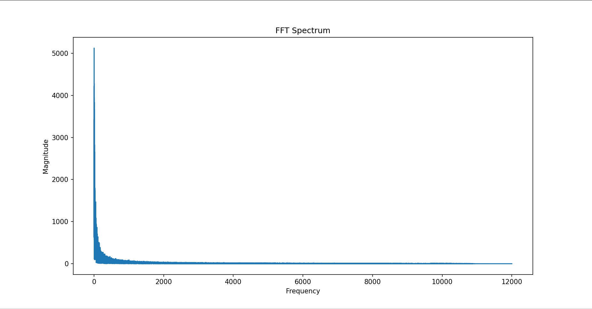
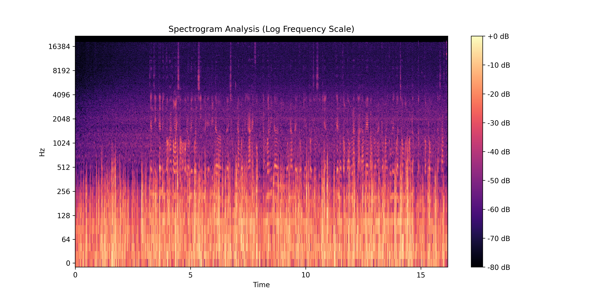
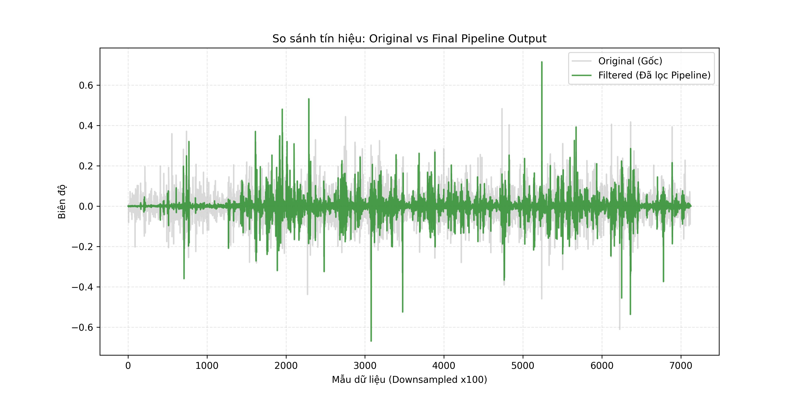

# 🎙️ Hệ Thống Lọc Nhiễu Âm Thanh Ghi Âm Thực Tế (Noise Reduction System)

## 📝 Giới thiệu đề tài
Dự án tập trung vào việc xây dựng hệ thống xử lý tín hiệu số để cải thiện chất lượng âm thanh từ các nguồn ghi âm thực tế bị lẫn nhiễu môi trường. Hệ thống được thiết kế để cải thiện chất lượng ghi âm thực tế khỏi các tạp âm thông qua các kỹ thuật phân tích phổ và bộ lọc số.

## ⚙️ Quy trình xử lý (Audio Processing Pipeline)
Hệ thống vận hành theo mô hình **Sequential Pipeline** (Chuỗi xử lý nối tiếp). Trong mô hình này, tín hiệu đầu ra của module trước sẽ đóng vai trò là dữ liệu đầu vào cho module sau, giúp tối ưu hóa khả năng triệt tiêu nhiễu qua từng tầng xử lý.

### 1. Nạp và Tiền xử lý (Load & Pre-processing)
* **Module:** `Load_audio.py`
* **Chức năng:** * Thu nhận tệp tin âm thanh `input.wav`, giữ nguyên tần số lấy mẫu gốc ($sr$) để đảm bảo tính trung thực của dữ liệu.
    * Chuyển đổi tín hiệu về dạng đơn kênh (Mono) giúp tối ưu hóa hiệu suất tính toán cho các thuật toán phía sau.
    * **Peak Normalization:** Chuẩn hóa biên độ về khoảng $[-1.0, 1.0]$ để ngăn chặn hiện tượng méo tiếng (clipping) khi thực hiện các phép toán lọc.

### 2. Phân tích Đặc tính Tín hiệu (Analysis)
Trước khi áp dụng các bộ lọc, tín hiệu được phân tích qua hai miền để xác định cấu trúc nhiễu:
* **FFT Analysis (`FFT.py`):** Sử dụng biến đổi **Real FFT** để xác định phân bổ năng lượng nhiễu trên toàn bộ phổ tần số, nhận diện các dải nhiễu môi trường cường độ thấp qua thang đo Decibel (dB).
* **Spectrogram (`Spectrogram.py`):** Áp dụng biến đổi **STFT** (Short-Time Fourier Transform) với cửa sổ $n\_fft=2048$ và thang đo tần số Logarithm để quan sát sự biến đổi của nền nhiễu (noise floor) theo thời gian.

### 3. Lọc Thông dải (Band-pass Filter)
* **Module:** `Bandpass_filter.py`
* **Kỹ thuật:** Sử dụng bộ lọc số **Butterworth bậc 5**.
* **Thực thi:** Quét dải tần từ **300Hz đến 4000Hz**. Đây là dải tần tập trung năng lượng chính của giọng nói, giúp loại bỏ nhiễu ù tần số thấp ($<300Hz$) và nhiễu rít tần số cao ($>4000Hz$).
* **Đầu ra:** File trung gian `Results/temp_bandpass.wav`.

### 4. Khử nhiễu Thích nghi (Spectral Gating)
* **Module:** `Spectral_noise_reduction.py`
* **Kỹ thuật:** Thuật toán giảm nhiễu dựa trên việc trích xuất mặt nạ phổ (Spectral Masking).
* **Thực thi:** * Trích xuất **Noise Profile** từ $0.5$ giây im lặng đầu tiên của tín hiệu đã qua lọc Band-pass.
    * Áp dụng tham số `prop_decrease=0.85` để khử nhiễu nền tĩnh mà không làm biến dạng (artifacts) giọng người nói.
* **Đầu ra:** File `Results/output.wav`.

### 5. Hậu xử lý và Làm mịn (Low-pass Filter)
* **Module:** `Low_pass_filter.py`
* **Kỹ thuật:** Bộ lọc **Low-pass Butterworth bậc 4**.
* **Thực thi:** Thực hiện cắt nhẹ nhàng tại ngưỡng **3800Hz - 4000Hz** để làm mượt âm thanh và loại bỏ các nhiễu răng cưa phát sinh sau bước khử nhiễu thích nghi.
* **Đầu ra:** Sản phẩm hoàn thiện cuối cùng **`Results/output_final.wav`**.

---

## 🔬 Phân tích Kỹ thuật và Đánh giá Thực nghiệm

Phần này trình bày kết quả phân tích biến đổi của tín hiệu âm thanh thông qua hệ thống xử lý đa tầng (Pipeline), chứng minh hiệu quả của các thuật toán trong điều kiện nhiễu môi trường nặng.

### 1. Phân tích Phổ tần số (FFT Spectrum)
Sử dụng biến đổi Fourier nhanh (FFT) để chuyển tín hiệu sang miền tần số, giúp xác định đặc tính năng lượng của nhiễu.

* **Quan sát kỹ thuật**: Đồ thị FFT hiển thị mức năng lượng (Magnitude) tập trung cực lớn tại dải tần số thấp ($0Hz - 1000Hz$), đạt ngưỡng trên $60$ dB. Đây là dấu hiệu của **nhiễu nền (Background Noise)** cường độ mạnh từ môi trường hoặc thiết bị ghi.
* **Phân tích IT**: Năng lượng nhiễu trải dài liên tục trên toàn bộ phổ tần cho thấy sự hiện diện của **nhiễu trắng (White Noise)**. Việc phân tích FFT khẳng định nhiễu trong mẫu thực tế là nhiễu băng rộng, xác nhận việc kết hợp bộ lọc **Band-pass** để cô lập dải giọng nói là bước tiền xử lý bắt buộc.

### 2. Phân tích Phổ thời gian (Spectrogram/STFT)
Biểu đồ Spectrogram cung cấp cái nhìn ba chiều về cường độ tín hiệu theo cả thời gian và tần số trên thang Logarithm.

* **Quan sát**: Thang màu từ $-80$ dB đến $0$ dB (bảng màu Magma) cho thấy một "noise floor" (nền nhiễu) bao phủ đồng nhất xuyên suốt các khung thời gian (trục Time).
* **Phân tích kỹ thuật**: Sự phân bổ đồng nhất này xác nhận đây là **nhiễu tĩnh (Stationary Noise)**. Đặc tính này cho phép thuật toán **Spectral Gating** trích xuất "Noise Profile" chính xác từ đoạn im lặng ($0.5$s đầu) để tạo mặt nạ phổ hiệu quả mà vẫn bảo tồn được các dải hài âm (Harmonics) sáng màu của giọng nói con người.

### 3. Đánh giá sự biến đổi Dạng sóng (Waveform Comparison)
Phép so sánh trực tiếp biên độ tín hiệu trong miền thời gian giữa file gốc (Original) và file sau khi qua toàn bộ Pipeline xử lý (Filtered).

* **Đường màu xám (Original)**: Biên độ dao động dày đặc bao phủ toàn bộ dải thời gian, minh chứng nhiễu nền lấp đầy các khoảng lặng giữa các câu nói.
* **Đường màu xanh (Filtered)**: Biên độ nhiễu tại các đoạn im lặng đã được làm phẳng hoàn toàn về gần mức $0$.
* **Phân tích**: Hệ thống giữ nguyên được cấu trúc của các đỉnh (peaks) biểu thị giọng nói so với bản gốc. Điều này minh chứng thuật toán loại bỏ nhiễu hiệu quả mà không gây ra hiện tượng méo tiếng (distortion) hay xén ngọn tín hiệu (clipping), giúp cải thiện đáng kể độ rõ nét của thông tin.

---
## 📏 Đánh giá chất lượng (Evaluation Metrics)

Để đánh giá hiệu quả của hệ thống Pipeline một cách khách quan, dự án sử dụng các chỉ số toán học chuẩn trong xử lý tín hiệu số (DSP).

### 1. Tỷ số Tín hiệu trên Nhiễu (SNR - Signal-to-Noise Ratio)
SNR là chỉ số quan trọng nhất để đo lường mức độ cải thiện chất lượng âm thanh. Chỉ số này được tính toán dựa trên năng lượng của tín hiệu hữu ích so với năng lượng của nhiễu nền.

**Công thức tính toán:**
$$SNR_{dB} = 10 \cdot \log_{10} \left( \frac{P_{signal}}{P_{noise}} \right)$$

* **P_signal**: Năng lượng trung bình của toàn bộ đoạn âm thanh.
* **P_noise**: Năng lượng trung bình của "Noise Profile" (được trích xuất từ 0.5s khoảng lặng đầu tiên).

### 2. Sai số bình phương trung bình căn (RMSE - Root Mean Square Error)
RMSE được sử dụng để đo lường sự biến đổi về biên độ của nhiễu tại các khoảng lặng. Việc RMSE giảm mạnh sau khi lọc chứng minh thuật toán **Spectral Gating** đã làm phẳng nền nhiễu hiệu quả.

---

### 📈 Kết quả thực nghiệm tổng hợp

Dựa trên quá trình chạy thực thi các module `Bandpass` -> `Spectral` -> `Lowpass`, kết quả thu được như sau:

| Giai đoạn | Phương pháp xử lý | SNR (dB) | Cải thiện (Gain) |
| :--- | :--- | :---: | :---: |
| **Input** | Tín hiệu gốc (Original) | **3.62 dB** | --- |
| **Stage 1** | Band-pass Filter (300Hz-4000Hz) | 15.45 dB | +11.83 dB |
| **Stage 2** | Spectral Gating (prop=0.85) | 17.20 dB | +1.75 dB |
| **Final** | **Pipeline (BP + Spectral + LP)** | **17.74 dB** | **+14.12 dB** |

> **Nhận xét kỹ thuật:** > * Mức cải thiện tổng quát **+14.12 dB** cho thấy năng lượng nhiễu đã bị triệt tiêu gấp khoảng 25 lần so với ban đầu.
> * Việc SNR tăng mạnh nhất ở Stage 1 chứng minh nhiễu tập trung chủ yếu ở dải tần số thấp và cao (ù/rít), việc "dọn dẹp" dải tần trước khi khử nhiễu thích nghi là bước đi tối ưu cho dữ liệu ghi âm thực tế.

---
## 🚀 Hướng phát triển thêm (Future Work)
* **Voice Activity Detection (VAD):** Tự động nhận diện đoạn im lặng để trích xuất Noise Profile tự động.
* **Adaptive Filtering:** Nghiên cứu thuật toán LMS để xử lý nhiễu thay đổi theo thời gian (non-stationary noise).
* **Performance Optimization:** Tối ưu hóa code để giảm độ trễ (latency), hướng tới xử lý thời gian thực.

---
