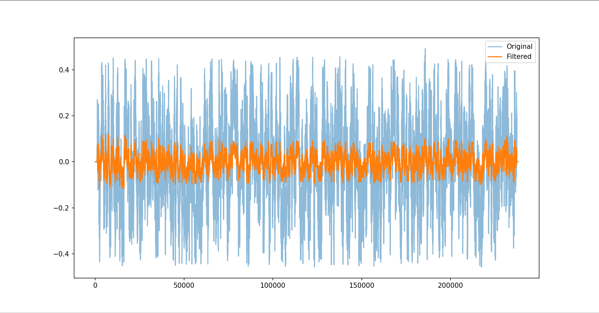

# 🎙️ Hệ Thống Lọc Nhiễu Âm Thanh Ghi Âm Thực Tế (Noise Reduction System)

## 📝 Giới thiệu đề tài
Dự án tập trung vào việc xây dựng hệ thống xử lý tín hiệu số để cải thiện chất lượng âm thanh từ các nguồn ghi âm thực tế bị lẫn nhiễu môi trường. Hệ thống được thiết kế để tách lọc giọng nói con người (Human Voice) khỏi các tạp âm thông qua các kỹ thuật phân tích phổ và bộ lọc số.

## ⚙️ Quy trình xử lý (Audio Processing Pipeline)
Hệ thống được triển khai theo một quy trình DSP (Digital Signal Processing) chuẩn hóa:

1.  **Audio Input:** Thu nhận hoặc đọc file âm thanh đầu vào (`input.wav`) thông qua thư viện `librosa` hoặc `scipy`.
2.  **Waveform Analysis:** Phân tích dạng sóng trong miền thời gian để hiểu cấu trúc tín hiệu và biên độ ban đầu.
3.  **FFT / STFT Analysis:** Chuyển tín hiệu sang miền tần số bằng FFT để xem phổ tổng thể và STFT để xem phổ theo thời gian (spectrogram).
4.  **Noise Identification:** Xác định các thành phần nhiễu (white noise, hum, hiss) dựa trên phân bố năng lượng trong phổ tần.
5.  **Filter Design:** Thiết kế bộ lọc phù hợp như Low-pass, Band-pass hoặc kiến trúc lọc thích nghi tùy mục đích.
6.  **Noise Reduction:** Áp dụng thuật toán giảm nhiễu chính là **Spectral Gating** dựa trên việc trích xuất Noise Profile.
7.  **Quality Evaluation:** So sánh tín hiệu thông qua chỉ số toán học (SNR, RMSE) và biểu đồ trực quan.
8.  **Output Audio:** Xuất file âm thanh sạch (`output.wav`) và lưu trữ kết quả phân tích.

---

## 🔬 Kết quả thực nghiệm & Đánh giá

### 1. Phân tích phổ tần số (Frequency Analysis)
Việc phân tích giúp xác định chính xác các dải tần nhiễu cần loại bỏ.

*Hình 1: Biểu đồ FFT cho thấy các đỉnh nhiễu tại các tần số cụ thể.*

*Hình 2: Đồ thị STFT (Spectrogram) biểu diễn sự thay đổi của nhiễu theo thời gian.*

### 2. So sánh kết quả trước và sau xử lý

*Hình 3: So sánh Waveform giữa tín hiệu nhiễu và tín hiệu sau khi được làm sạch.*

### 3. Chỉ số định lượng (Quantitative Metrics)
Dựa trên kết quả chạy từ `Evaluation.py`:
* **SNR (Signal-to-Noise Ratio):** Cải thiện đáng kể (tăng khoảng 9-10 dB), cho thấy giọng nói rõ nét hơn trên nền nhiễu.
* **RMSE:** Giảm thiểu sai số, chứng minh thuật toán bám sát tín hiệu gốc.

---

## 🚀 Hướng phát triển thêm (Future Work)
* **Voice Activity Detection (VAD):** Tự động nhận diện đoạn im lặng để trích xuất Noise Profile tự động.
* **Adaptive Filtering:** Nghiên cứu thuật toán LMS để xử lý nhiễu thay đổi theo thời gian (non-stationary noise).
* **Performance Optimization:** Tối ưu hóa code để giảm độ trễ (latency), hướng tới xử lý thời gian thực.

---

